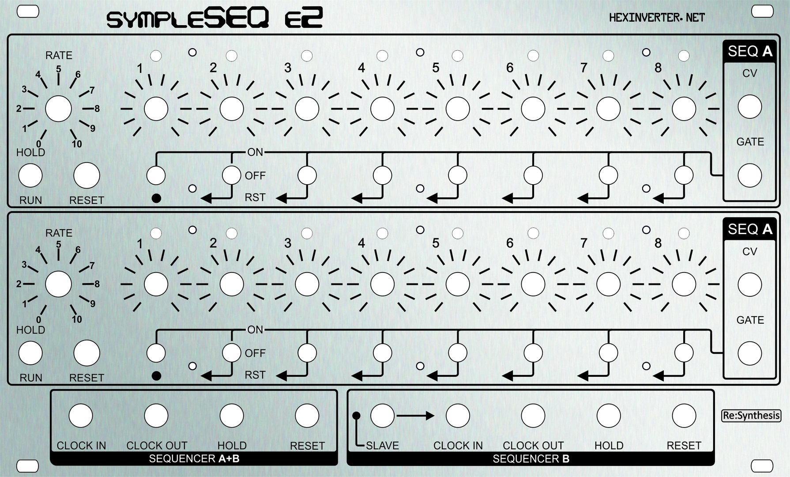

# KicadJE_SympleSequencer
Designed to fit the faceplate of a Hexinverter SympleSeq E2 faceplate from Re:Synthesis

# Purpose
1 - Match Hexinverter sch with Resynthesis panel

# Status - ordered
## Initial 
| Stage  | Detail | Status |
| ------------- | ------------- | ------------- |
| create material  | sch/pcb | OK  |
| | gerber | OK |
| production  |   | ordered |
|  | produced |  |
|  | delivered |  |

## Preliminary validation
| Test  | Detail | Status |
| ------------- | ------------- | ------------- |
| Initial Inspection | |  |
| Initial Technical Test |  | |
| Initial Product Test |  | |

## Secondary validation
| Test  | Detail | Status |
| ------------- | ------------- |------------- |
| Product Test |  | |
| Product Test |  |  |
| Quality | | |
| Quality |  |  |
| Long Term Product Test |  |  |
| Power Draw |  | 

## Errata
### Errata - clock
### Errata - control

## Issues and Notes
### Clock
1 -

2 - 
### Control

# Pictures

# Inspiration from 
Counter module in https://github.com/promesoft/KicadJE_EffectsUnit1
