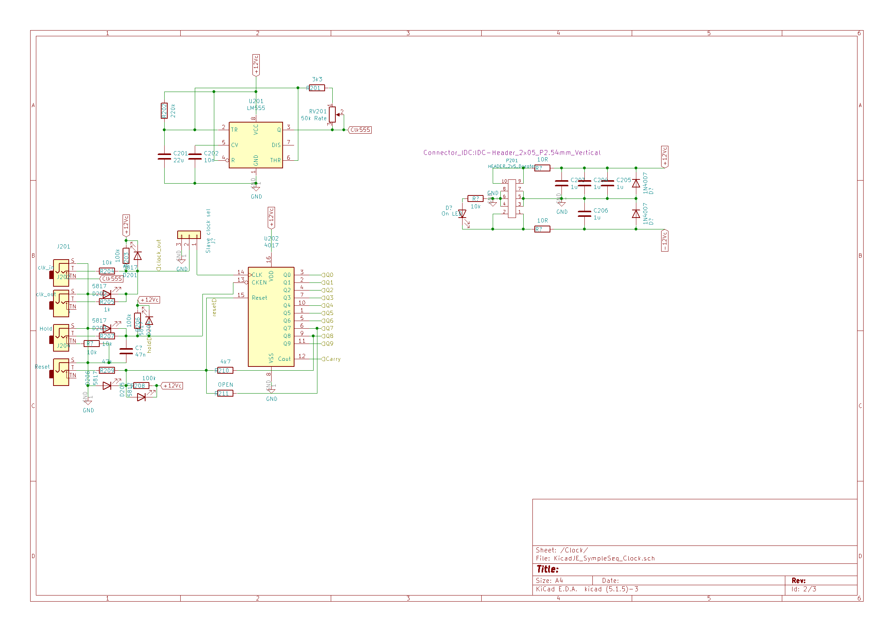
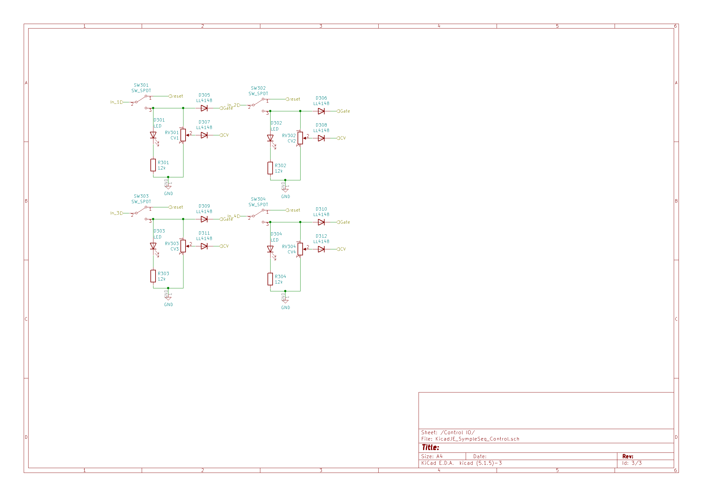
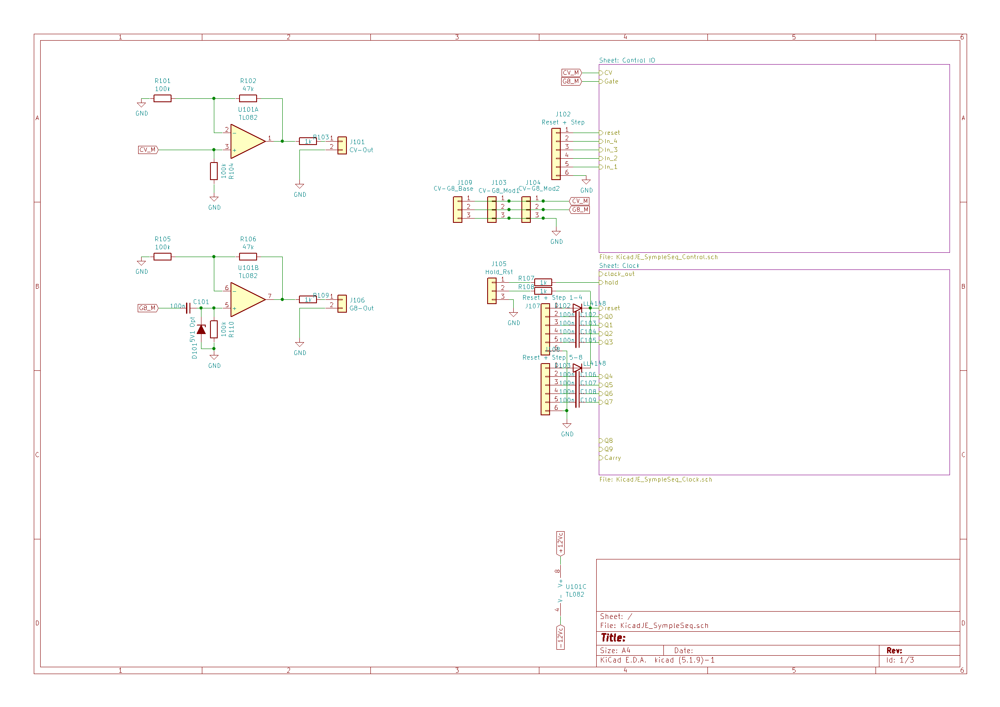
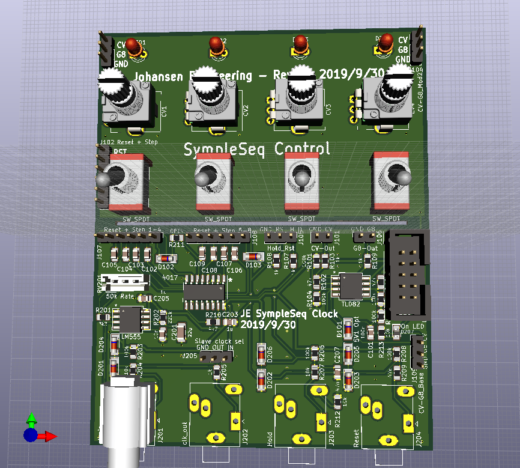
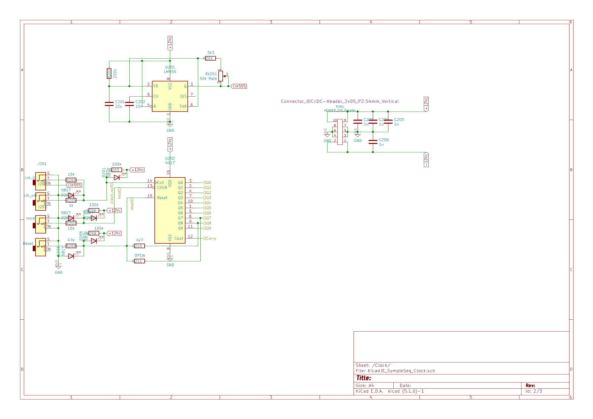
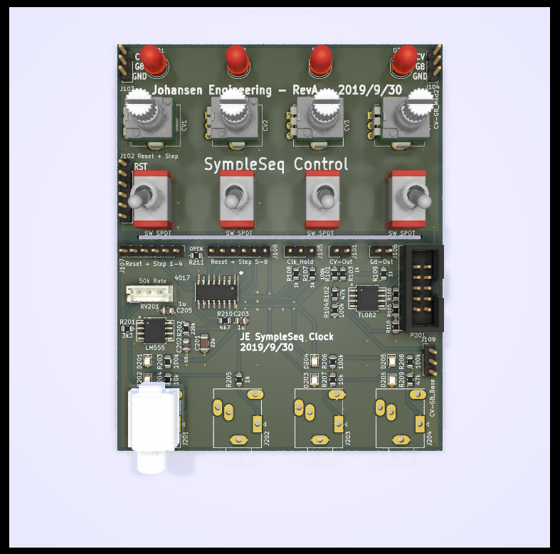

# KicadJE_SympleSequencer
Designed to fit the faceplate of a Hexinverter SympleSeq E2 faceplate from Re:Synthesis

# Purpose
1 - Match Hexinverter sch with Resynthesis panel

# Rev 2

# Status - Mouted - testing
## Initial 
| Stage  | Detail | Status |
| ------------- | ------------- | ------------- |
| create material  | sch/pcb | OK  |
| | gerber | OK |
| production  |   | ok |
|  | produced | ok |
|  | delivered | ok |

## Preliminary validation
| Test  | Detail | Status |
| ------------- | ------------- | ------------- |
| Initial Inspection | clock board| ok |
| Initial Inspection | control board | ok  |
| Initial Technical Test |  | 100n capacitors in series w output is replaced w 2k |
| Initial Product Test |  | 100n C101 capacitor parallel w 150k |
| Initial Product Test |  | ongoing |

## Secondary validation
| Test  | Detail | Status |
| ------------- | ------------- |------------- |
| Product Test | CV |  |
| Product Test | Gate | |
| Product Test | Clock internal |  |
| Product Test | Clock in |  |
| Product Test | Clock out |  |
| Product Test | Reset In/Button |  |
| Product Test | Hold In/Button |  |
| Quality | CV |  |
| Quality | Gate |  |
| Long Term Product Test |  | Good |
| Power Draw |  | 

## Errata
### Errata - clock
#### Series capacitors not working with reset (overloads CD4017) - replace w resistors
### Errata - control
#### 

## Issues and Notes
### Clock
1 - diodes for hold input  
2 - diodes for reset input  
3 - Gate AND Clock for gate output to reset between gates - consider making a phase adjust for shorter/longer gates
### Control
1 - switches still reversed  
2 - diode missing for reset  

# Schematics

# Pictures

# Rev 1

# Status - Installed in rack - tweaking
## Initial 
| Stage  | Detail | Status |
| ------------- | ------------- | ------------- |
| create material  | sch/pcb | OK  |
| | gerber | OK |
| production  |   | ok |
|  | produced | ok |
|  | delivered | ok |

## Preliminary validation
| Test  | Detail | Status |
| ------------- | ------------- | ------------- |
| Initial Inspection | clock board| ok - the jacks are 0,5-1mm too far away from the edge |
| Initial Inspection | control board | ok - see errata 3 |
| Initial Technical Test |  | ok |
| Initial Product Test |  | ok |

## Secondary validation
| Test  | Detail | Status |
| ------------- | ------------- |------------- |
| Product Test | CV | ok |
| Product Test | Gate | See errata 4|
| Product Test | Clock internal | ok - a bit slow |
| Product Test | Clock in | ok |
| Product Test | Clock out | ok - could need a buffer |
| Product Test | Reset In/Button | ok |
| Product Test | Hold In/Button | ok - needs debounce |
| Quality | CV | Good |
| Quality | Gate | No good - needs shorter pulses |
| Long Term Product Test |  | Good |
| Power Draw |  | 

## Errata
### Errata - clock
#### 1 - Missing slave clk function (add diode or buffer - consider val of  R204 on master)
#### 4 - Gate signal becomes glide if two adjacent notes are on (never goes to 0V - consider AC couple)
#### 5 - Hold works - but can be a bit jumpy if clocked faster than clk
#### 7 - Hold button needs debounce (47nF?)

### Errata - control
#### 2 - D310 not connected to G8 output
#### 3 - Switches upside down (still works just opposite the faceplate signs)
#### 6 - Switches in reset works one at the time. Mutliselect becomes strange (diode missing)

## Issues and Notes
### Clock
1 - Missing silk on Jacks

2 - 
### Control

## Vital Components
 - CD4017
 - LM555
 - Jack connectors: PJ-324M (important for the footprint)
# Schematics

# Pictures

# Inspiration from 
Counter module in https://github.com/promesoft/KicadJE_EffectsUnit1
